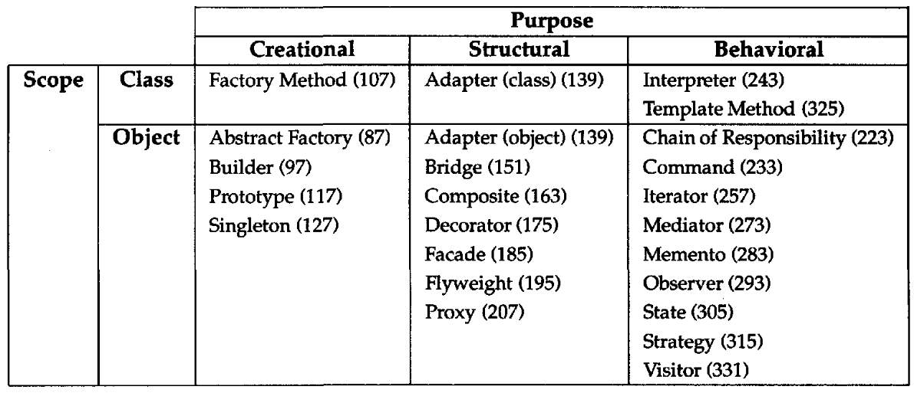

# Pattern Classification Criterion

1. Purpose
    - Creational: Concerns with object creation.
    - Structural: Composition of classes and objects.
    - Behavioural: Interaction and responsibility sharing of classes and objects.
2. Scope: pecifies whether the pattern applies primarily to classes or to objects.
    - Class: 
        - Class patterns deal with relationships between classes and their subclasses.
        - These relationships are established through inheritance, so they are static/fixed at compile-time
    - Object:
        - Object patterns deal with object relationships, which can be changed at run-time and are more dynamic. 

# design-patterns
